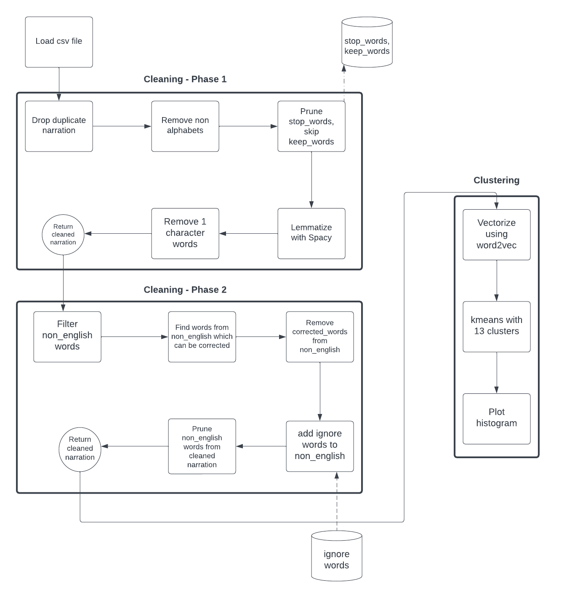
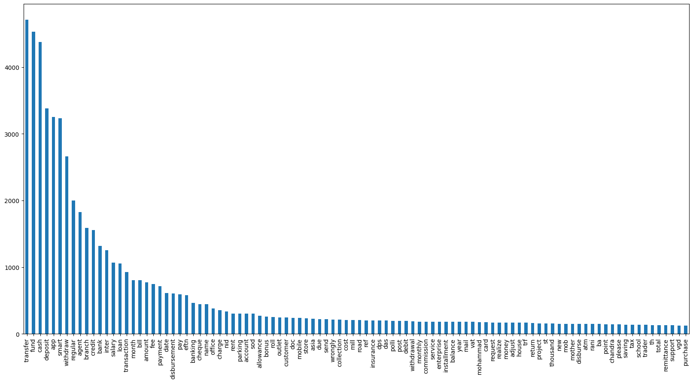
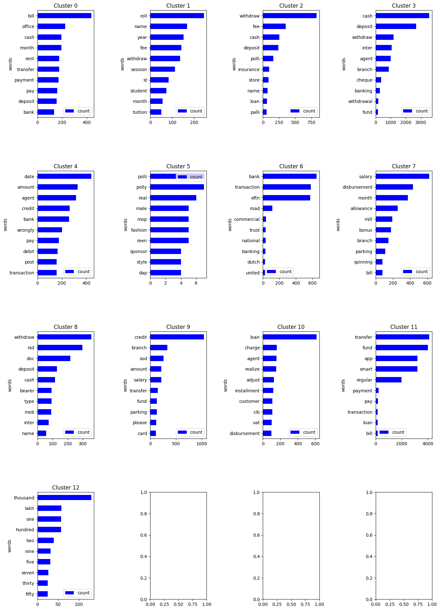

# Unsupervised Clustering of Bank Transactions

The aim of this project is to cluster bank transactions into different categories. The dataset contains around 22M transactions from customers all over the country. These transactions are clustered into 13 different categories.

## Data cleaning
 - Drop duplicates
 - Filter non-alphabetical characters
 - Filter stop words
 - Lemmatize with spacy
 - Find non-english words
 - From the set of non-english words, remove those that can be corrected using symspellpy
 - Remove non-english words from the dataset
 - Vectorize the dataset using word2vec
 - Run KMeans clustering on the vectorized dataset
## Pipeline for data cleaning

## Results
### Top 100 words of the dataset after cleaning

### Top 10 words of each cluster

